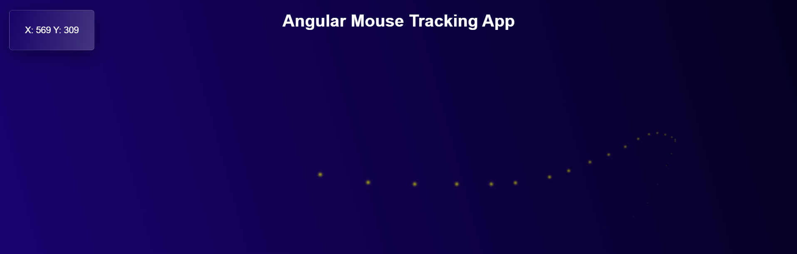

# Angular Mouse Tracker Project

This project was generated with [Angular CLI](https://github.com/angular/angular-cli) version 15.2.11 and demonstrates how to track mouse movements on a web page. It includes creating a neon trail that follows the cursor. The project also uses the state management library NgRx to store mouse coordinates and showcases the use of various Angular decorators and RxJS operators to optimize DOM updates.



## Features

- Tracks mouse movements and creates a neon trail that follows the cursor.
- Uses RxJS to handle mouse movement events.
- Optimizes DOM updates with `throttleTime` and `distinctUntilChanged` operators.
- Stores mouse coordinates in the state using NgRx.

## Installation and Running

1. Clone the repository:
   ```sh
   git clone <URL of your repository>
   ```
2. Navigate to the project directory:
   ```sh
   cd <your project name>
   ```
3. Install dependencies:
   ```sh
   npm install
   ```
4. Run the project:
   ```sh
   ng serve
   ```
5. Open in your browser:
   ```sh
   http://localhost:4200
   ```
